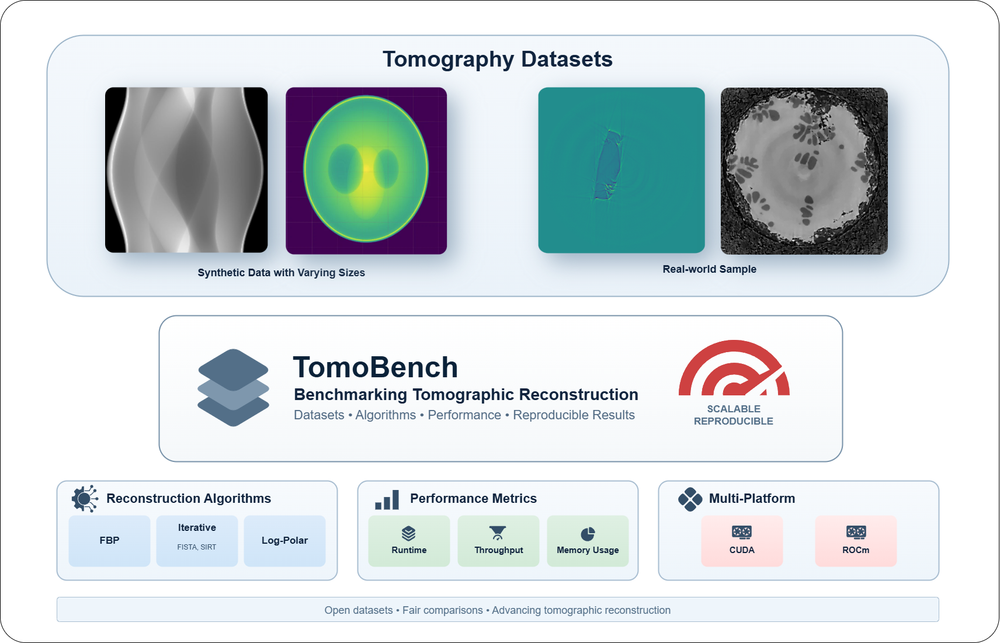

<div align="center">
  
  <h3 align="center">
    Tomography benchmark suite
  </h3>
  <p align="center">
    Comparing Filtered BackProjection (FBP) and Log-Polar Reconstruction (LPRec) pipelines
  </p>
  <p align="center">
    <a href="https://diamondlightsource.github.io/httomo/index.html">
      <b>httomo</b>
    </a>
    <span> • </span>
    <a href="https://www.silx.org/pub/nabu/doc/index.html">
      <b>Nabu</b>
    </a>
    <span> • </span>
    <a href="https://tomocupy.readthedocs.io/en/latest/">
      <b>TomoCuPy</b>
    </a>
    <span> • </span>
    <a href="#usage">
      <b>Usage</b>
    </a>
  </p>
</div>

## Repository structure

- [batch](batch) sbatch scripts to execute jobs on the supercomputer cluster. These scripts target Komondor and need modifications to run elsewhere.
- [pipelines](pipelines) Tomography pipeline definitions
- [scripts](scripts) Extra scripts e.g. to generate the input dataset
- [environment.yml](environment.yml) Conda environment definition
- [justfile](justfile) Common task definitions for the [just](https://just.systems) command runner
- [tomobenchmarks.def](tomobenchmarks.def) Definition of the Singularity/Apptainer image to execute the benchmarks in

## Usage

### Running the small benchmarks locally

1. Make sure, that the [just](https://just.systems) command runner and the [conda](https://www.anaconda.com/docs/getting-started/installation) package manager is installed and available on the path.
2. Build the Conda environment: `just recreate-env`. Note, that this removes and recreates the environment named `tomobenchmarks`.
3. Generate the input dataset: `just generate-input`. This creates a Nexus file in the working directory that is a synthesized Shepp-Logan phantom. The format is compatible with all benchmarked tomography suites.
4. Run all small-data benchmarks: `just run-all`. This executes all pipelines defined in the repository.

### Running the small and large benchmarks on a cluster

Note, that these steps are specific to the Komondor supercomputer, and must be adapted to run on other systems.

1. Build the Singularity/Apptainer image:

```
module load apptainer
apptainer --verbose build tomobenchmarks.sif tomobenchmarks.def
```

2. Generate the input datasets. Since this task is compute-intensive, it should be executed on the CPU partition of the cluster. The job is submitted by `sbatch`, and `synthetic.nx` and `synthetic-huge.nx` should appear in the working directory as a result.

```
sbatch batch/generate-input-data.sbatch
```

3. Run the small benchmark suite on the GPU partition of the cluster. This uses a single GPU. The resulting logs and output data files are generated in the working directory.

```
sbatch batch/run-default.sbatch
```

4. Run the large benchmarks on the GPU partition of the cluster. These use all 4 GPUs on a single node. In this case, both benchmarks should be executed as a separate job:

```
sbatch batch/run-httomo-fbp-preproc.sbatch
sbatch batch/run-nabu-fbp-preproc.sbatch
```